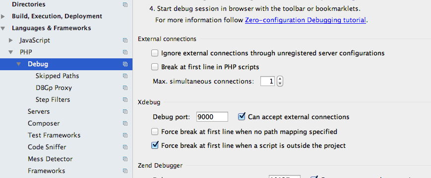
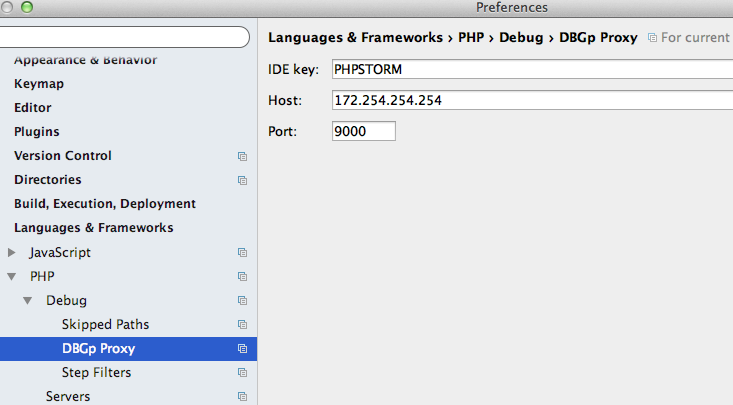
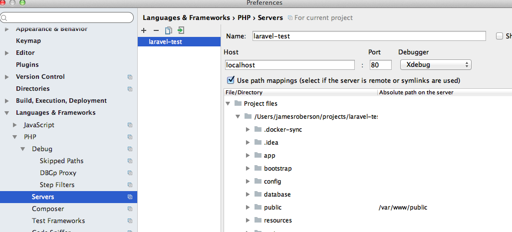
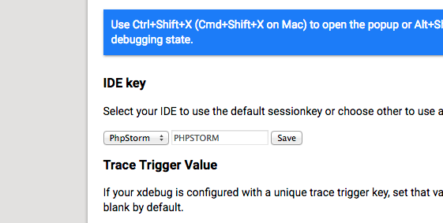
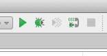
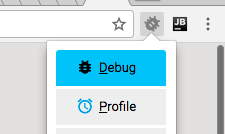

# Dockerfile - php71-fpm with XDebug for Development
This image is for composing with php-fpm with nginx: https://github.com/Jamesway/docker-compose-php71-lamp-stack

## Installation
```
docker pull jamesway/php71-fpm-xdebug
```

## Xdebug with PhpStorm

### OS X Network Alias
Docker on OS X as an issue with outbound communication so as a workaround, create an alias to the "xdebug.remote_host" in the php-fpm dockerfile (172.254.254.254). It doesn't matter what IP is, but they have to match. If you restart your Mac you may need to re-alias.

```
sudo ifconfig en0 alias 172.254.254.254 255.255.255.0
```

*Note: if running Docker for Mac, you can skip the alias by setting "xdebug.remote_host" to docker.for.mac.localhost (untested)*

### PhpStorm (as of 2017.2)

#### Debug


Open Preferences -> Languages & Frameworks -> PHP -> Debug
- Under "Xdebug" make sure the "Debug port" is the same as "xdebug.remote_port" in the php-fpm dockerfile (9000)
- make sure "Can accept external connections" is checked

#### DBGp Proxy


Open Preferences -> Languages & Frameworks -> PHP -> Debug -> DBGp Proxy
- Set IDE Key to the same key as "xdebug.idekey" in the php-fpm dockerfile (PHPSTORM)
- Set Host to the same IP as "xdebug.remote_host" in the php-fpm dockerfile (172.254.254.254)
- Set Port to the same port as "xdebug.remote_port" in the php-fpm dockerfile (9000)

#### Servers


Open Preferences -> Languages & Frameworks -> Servers
- Add a new server for this project (+), the name can be anything
- Host must match the nginx server_name directive in vhost.conf (locahost)
- Set port to 80
- Check "use path mappings" and set the local source path as /var/www in the remote server (nginx). This way xdebug can see the code in the source root /var/www and /var/www/public. *Note the image shows mapping src/public -> /var/www/public. This is ok, but another more important map should be added for src -> /var/www* 

### Chrome Plugin Xdebug helper

Install the plugin: https://chrome.google.com/webstore/detail/xdebug-helper/eadndfjplgieldjbigjakmdgkmoaaaoc?hl=en

Right click on the bug icon and select "Options"



Under "Ide key" select "PhpStorm" and enter the same key as "xdebug.idekey" in the php-fpm dockerfile (PHPSTORM)

### Using Xdebug with PhpStorm

Sample docker-compose: https://github.com/Jamesway/docker-compose-php71-lamp-stack
```
docker-composer up -d
```



In PhpStorm, Listen for debug connections and set a break point




Reload in chrome with xdebug helper enabled and PhpStorm should take focus and allow you to step through
